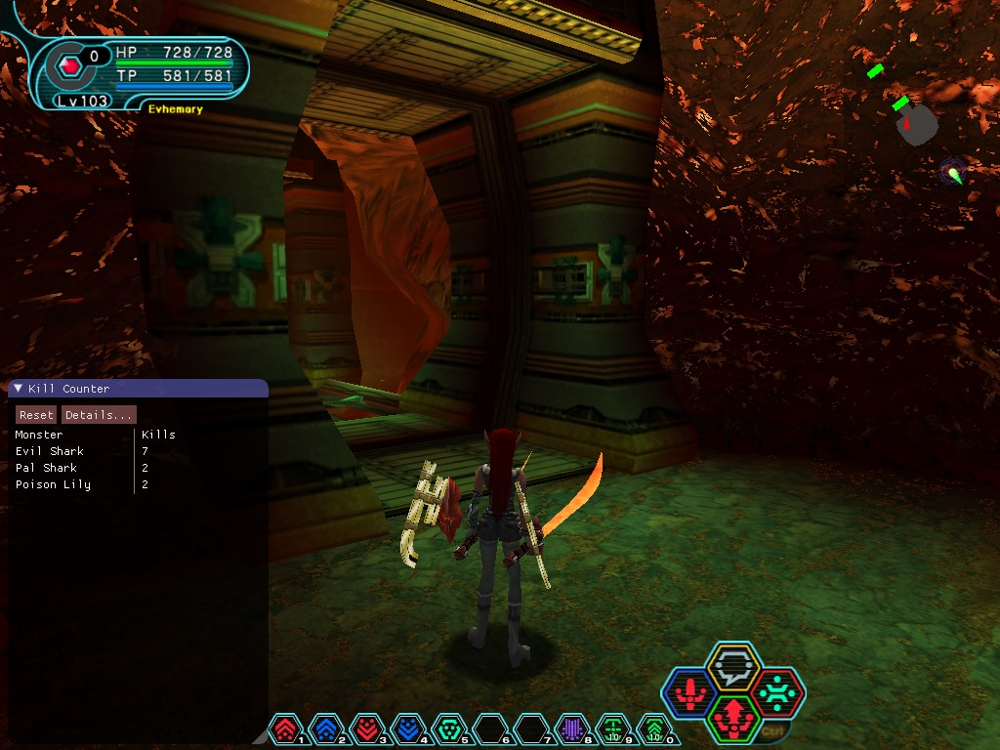

# psobb-kill-counter
Addon to track statistics on number of enemies defeated in PSO:BB

This addon is based heavily on the Monster HP addon in the
[PSOBBMod-Addons](https://github.com/Solybum/PSOBBMod-Addons) project.
Some of the scripts used for this project were taken directly from there.
Attribution for each file is provided in a header comment at the top of each
file.

## Installation
* Download [version 0.3.3](https://github.com/HybridEidolon/psobbaddonplugin/releases/tag/v0.3.3)
  of the [psobbaddonplugin](https://github.com/HybridEidolon/psobbaddonplugin)
  project (bbmod.zip)
* Extract the `dinput8.dll` file and place it in the root directory of your
  PSO installation
* Extract the `addons` folder and place it in the root directory of your
  PSO installation as well
* Download [psobb-kill-counter-master.zip](https://github.com/StephenCWills/psobb-kill-counter/archive/master.zip)
* Extract the `Kill Counters` folder and place it in the `addons` folder
  that you copied to your PSO root directory

## Screenshots

